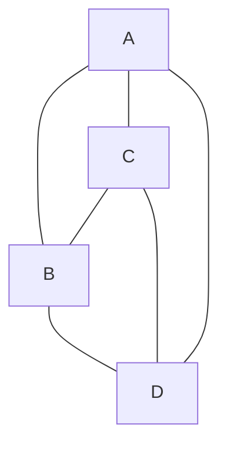
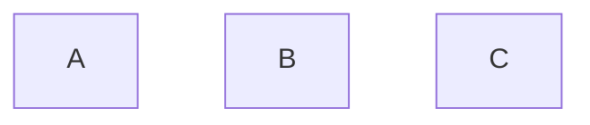
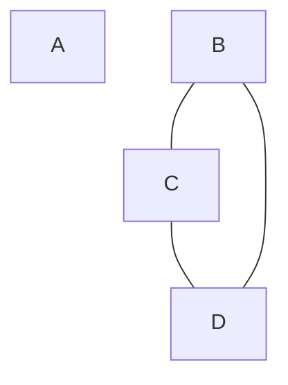

# TCC *vs* LCC

Explain under which circumstances *Tight Class Cohesion* (TCC) and *Loose Class Cohesion* (LCC) metrics produce the same value for a given Java class. Build an example of such as class and include the code below or find one example in an open-source project from Github and include the link to the class below. Could LCC be lower than TCC for any given class? Explain.

## Answer

Pour que TCC et LCC aient la même valeur, il faut que le graphe de la classe soit connexe ou que ces sous graphes soient connexe eux-même. Voici un exemple:

```java
public class Exemple {
    private int x = 11;
    private int y = 10
    
    public int A() {
      return x + y;
    }
    
    public int B() {
      return x - y;
    }
    
    public int C() {
      return x * y;
    }
    
    public int D() {
      return y - x;
    }
}
```
Dans cet exemple, TCC et LCC valent 1.
Voici le graphe qui représente la classe :


Voici deux autres exemples de graphe où TCC et LCC ont la même valeur :


Ici, TCC et LCC valent 0.


Ici, TCC et LCC valent 1.

LCC ne peut pas être inférieur à TCC. C'est impossible puisque TCC prends seulement les chemins directs alors que LCC prends les chemins directs et indirects. LCC sera toujours égale ou supérieur à TCC.
